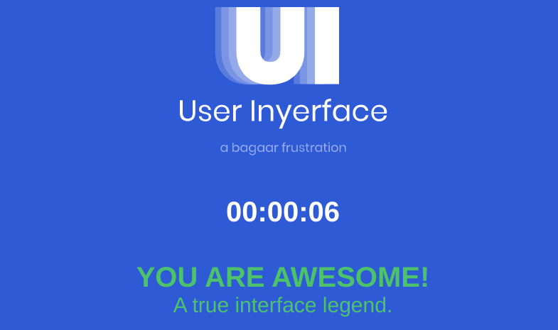

# Userinyerface Selenium speedrun

I fist came across [userinyerface.com](https://userinyerface.com/) during my
QA automation engineering internship. It challenges the user 
to register on a fictional page which uses the worst possible UI practices.
I liked the concept a lot, and decided to "speedrun" it to present
what I've learned. 

<!-- TOC -->
  * [How to run](#how-to-run)
  * [How to run tests](#how-to-run-tests)
  * [Current record](#current-record)
  * [Notes on implementation details](#notes-on-implementation-details)
  * [Issues and limitations](#issues-and-limitations)
  * [Specifics on my attempt strategy](#specifics-on-my-attempt-strategy)
<!-- TOC -->

## How to run

1. Make sure Chrome is installed and 
[ChromeDriver](https://chromedriver.chromium.org/home) is downloaded.
2. Load Maven dependencies from `pom.xml`.
3. Edit the "driverPath" parameter in `config.json`
(along other Chrome options as preferred).
4. Run `src/main/java/Main.java`

## How to run tests

1. Load Maven dependencies from `pom.xml`
2. Edit `settings.json` and `testData.json`
as needed. No drivers required thanks to Aquality
3. Run one or more tests, either manually or using
`testng.xml`

## Current record

**Time on page**: 00:00:04

**Measured time**: 0m:4s:647568989ns

## Notes on implementation details

I originally made my tests with a somewhat class-heavy Page Object Model (POM)
design pattern with an extra library my company uses -
[Aquality](https://github.com/aquality-automation/aquality-selenium-java).

I decided to use "vanilla" Selenium for the actual speedrun, but also
stick to POM. I realise that abstraction will slow me down a bit,
but this is primarily a demo of my skills and practices - the speedruning
challenge is just a bonus.

On tests, however, I use Aquality as I originally did. It's quite "bloated",
but useful. I am NOT going to implement more tests unless I have a very good
reason.

## Issues and limitations

* The speedrun fails to run `--headless`
* For now the profile image must be uploaded manually.
  `webElement.sendKeys("/path/to/some-image.png")` doesn't work.
  I originally used an AutoIT script on Windows 10. I considered
  doing something similar for Linux and/or reintroducing the Windows script,
  but I'm afraid it would be slower (sic!) than manual upload.

## Specifics on my attempt strategy

1. I upload an empty file "image" (you can choose any filetype)
  with arrow-right and-then enter keys (via Nautilus on POP!_OS)
2. On card 3, I call `.clear()` and `.sendKeys("foo")`
  on all input fields found with `driverFindElements()`. 
3. Card 3 dropdown fields are more tricky:
   - "Mrs" title is chosen to avoid changing gender. 
   - Year, month and day are checked with `if-else` statements so that
   birthday can match the age of 0 to avoid having to mess with the slider. 
   - Ideally I would only do it with year, but day and month misbehave. 
   - A `for-each` loop with `if-else` is probably far from ideal - for now I'm
   a little fed up with the project, but I might try to improve it later on.
